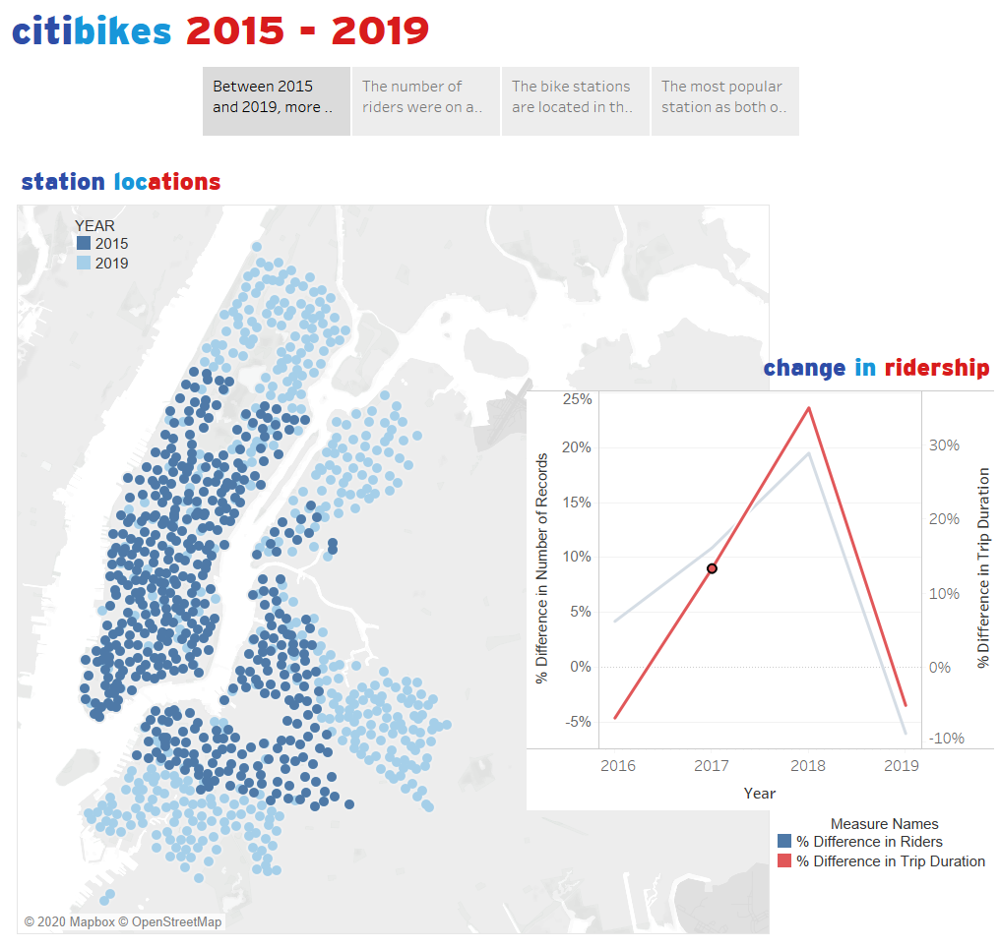
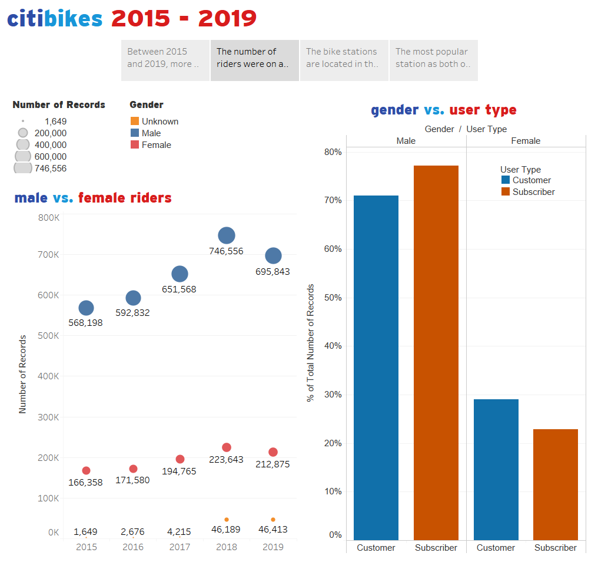
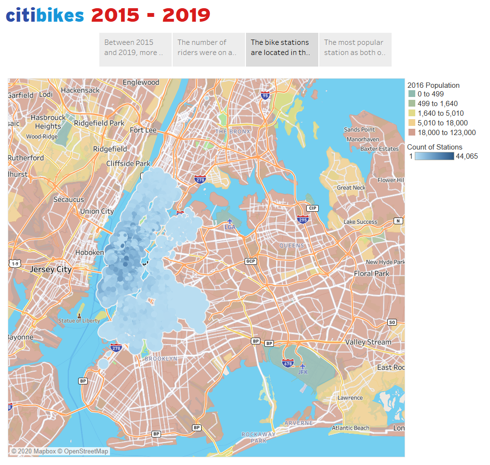
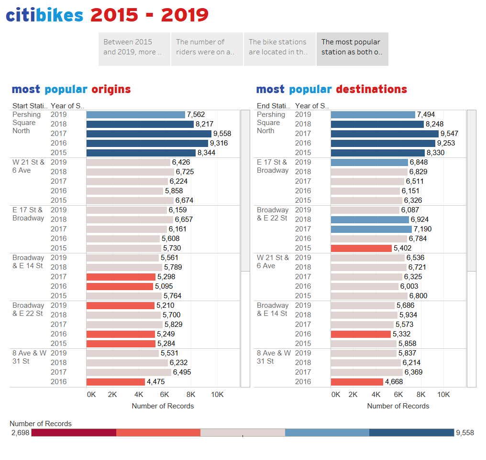

# citi bikes 2015 - 2019

Use Tableau to create visualizations that describe the citi bikes program usage between the years 2015 and 2019.  CSV files were downloaded from the [Citi Bike Data](https://www.citibikenyc.com/system-data) web page.

See the [story](https://public.tableau.com/profile/stephanie.lin4229#!/vizhome/CitiBikes_15806291225290/Story1)

### Preparing the Data

Since all rows contain unique usage data, I elected to use union instead of joins for all the CSV files.  Prior to combining the data from all years, I made sure:
* All headers are the same to avoid causing issues in the union
* All trip start and end times are in the same format
* Checked to ensure no null values in coordinates

### Discovering Info

I was interested in how the citi bikes program change over time.
* Although the number of bikes stations increased from 2015 to 2019, number of riders decreased.  The average duration of trips declined as well.

* There are more male riders than female riders.  Male riders tend to be subscribers of the bike program; the opposite is true for female riders.  The decline in ridership is apparent in this visualization as well.

* The bike stations are logically located in highly populated areas.

* The most popular station as both origin and destination is Pershing Square North.  The other four stations alternate to be amongst the top five stations.  Pershing Square North is located near Grand Central Station - it is possible riders use the bikes to complement the needs of their daily commutes.

* Provided with additional time and resources, it will be interesting to find out why ridership declined in 2019.

